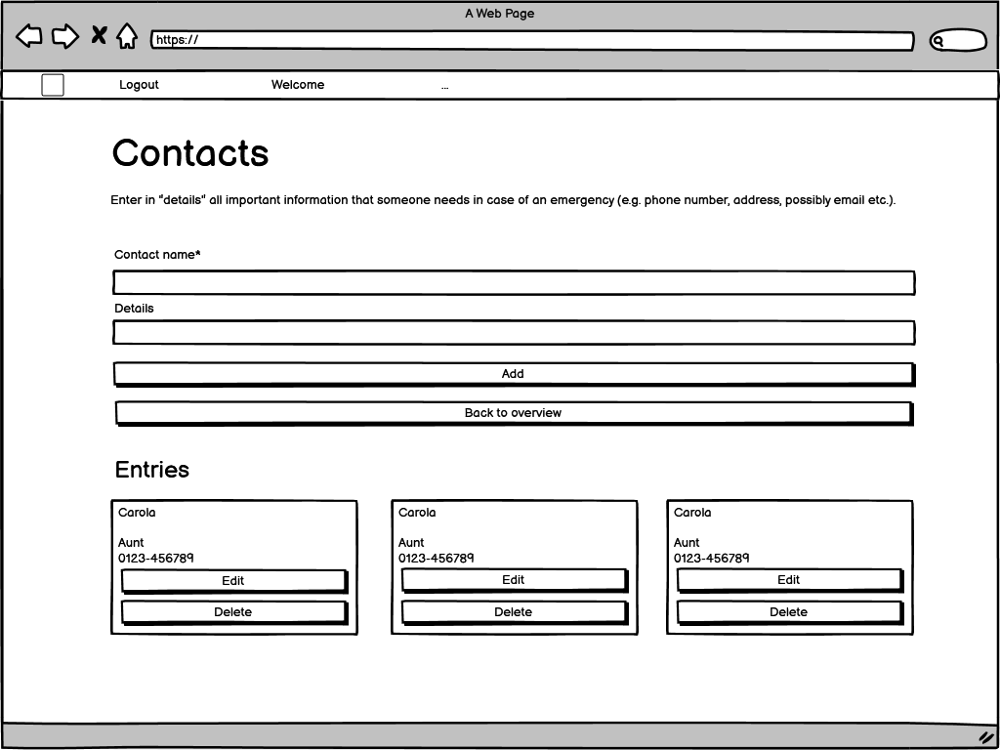
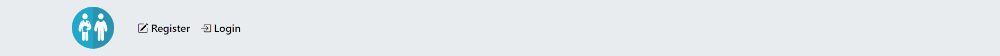

## CONTENTS

* [Introduction](#introduction-digital-patient)
* [User Experience - UX](#user-experience)
  * [UX](#ux)
    * [Site purpose](#site-purpose)
    * [Site goal](#site-goal)
    * [Audience](#audience)
  * [User stories](#user-stories)
    * [First time user goals](#first-time-user-goals)
    * [Returning user goals](#returning-user-goals)
  * [Agile methodology](#agile-methodology)
  * [Design](#design)
    * [Colours](#colours)
    * [Typography](#typography)
    * [Media](#media)
    * [Database schema](#database-schema)
    * [Wireframes](#wireframes)
* [Features](#features)
  * [Existing features](#existing-features)
  * [Future features](#future-features)
* [Technologies used](#technologies-used)
  * [Languages](#languages)
  * [Frameworks libraries, programs](#frameworks-libraries-programs)
* [Testing](TESTING.md)
* [Deployment](#deployment)
  * [Forking](#forking)
  * [Cloning the repo with GitPod or Codeanywhere](#cloning-the-repo-with-gitpod-or-codeanywhere)
  * [Running the project locally](#running-the-project-locally)
  * [Deploying with Heroku](#deploying-with-heroku)
* [Credits](#credits)

# Introduction: Digital patient

Project Portfolio 4 for Code Institute Full-stack development program. Digital patient is a full stack Django project that runs on Heroku.

The site allows users to register and log in from the frontend. Once registered and logged in users can edit personal data, edit, add and delete diseases/medications, doctors and contacts.

The live website on Heroku can be accessed at the following link: [View my Live Website here](https://digital-patient-807175a8312b.herokuapp.com/)

# User Experience
<a href="#top">Back to the top.</a>

## UX

### Site purpose

This program is designed to make it easier for a patient to keep track of their doctors, diseases, medications, as well as (emergency) contacts. In addition, in the case of an emergency, it should be possible for doctors to see a readable version of the patient's profile to see previous diseases, medications, previous doctors and emergency contacts.

### Site goal

To build a website where a kind of digital patient dossier can be easily shared by the patient him/herself for possible emergencies.

A tool like this does not (yet) exist in Germany, and in the case of an emergency with, for example, an unconscious patient, the doctors may not know any previous diseases, medications, general practitioners or emergency contacts, or they may first have to laboriously collect these on individual platforms or (mobile) devices.

### Audience

For anyone who wants to have all their emergency data on one platform for potential doctors in case of an emergency.

## User stories

### First time user goals

- As a first time user I can find information what the purpose of the website is.

### Returning user goals

- As a (returning) user I can register for an account so that I can login after registration.
- As a returning user I can log in to my registered account.
- As a returning user I can log out of my registered account.
- As a returning user I can edit my personal data.
- As a returning user I can edit, add and delete medication/diseases, doctors and contacts in my registered account.
- As a returning user I can share a readable version of my account with potential doctors in case of an emergency.

## Agile methodology

The principles of agile methodology were utilized during the project. Github issues were used to create User Stories for the project. Each user story (including user acceptance criteria, tasks and story points) can be displayed on the board or in the issues. By assigning user stories to issues and taking advantage of the GitHub Kanban board functionality, the necessary goals and priorities throughout the project could be well defined. In addition, labels were used to further define the priority of each user story in the Kanban board.

Through the use of the Kanban board in the projects view in Github, the project was divived into a few different sections:

- Add-ons
- To-do
- In progress
- Done

Milestones were used to create sprints. There were 3 sprints each dated appropriately. User Stories were completed based on the current sprint in progress. Each sprint was completed on time.

## Design

### Colors

I decided to use calming colors, primarily shades of blue. Blue is the typical business color, as it is sober, businesslike, calming and trustworthy, and it maintains its character even in different gradations. It best connects to the goal of the website. To keep the contrast between the background and the font, a basis black tone and a lightly grey is included. All colors also connect to Bootstrap's existing colors (primary, secondary and dark).

### Typography

Utilized the Bootstrap 5 native font stack that selects the best font-family for each OS and device. Besides this, the font gives a calm and serious impression.

### Media
The pictures (background image, favicons) were taken from [Pixabay](https://pixabay.com/).

### Database scheme
The database model reflects the different areas of the website: the personal data through the model "UserProfile", the entries for medications/diseases through the model "MediDisLis", the entries for doctors through the model "Doctor" and the entries for contacts through the model "Contact".

### Wireframes
Initial wireframes

#### Home page

#### Register

#### Login

#### Overview (profile)

#### Personal data

#### Edit personal data

#### Medications/Diseases

#### Doctors

#### Contacts

# Features
<a href="#top">Back to the top.</a>

## Existing features

- __Home screen__
  - The home screen shows information about the website and explains briefly in a FAQ the most important things.
  - The image is intended to symbolize the interface between doctor and patient via the digital medium/the website.

  

- __Navigation Bar__
  - The navigation bar appears on each page.
  - The home screen can be displayed by clicking on the logo on the left side.
  - The navigation bar for unauthenticated users contains links to the home screen, register and login.

  

  - The navigation bar for authenticated users contains links for logout and a drop down menu with links to the five important pages of the website: Overview (profile), personal data, medication/diseases, doctors, contacts.

  
  

  - The navigation bar will allow the users to easily navigate from page to page across all devices.
  - The navigation bar is fully responsive. On smaller devices, the hamburger menu appears with an expanded menu bar.

  

  

- __Footer__
  - The footer appears on each page.
  - The footer is sticky.
  - The footer contains a copyright and a link to Code Institute which opens in a new tab.

  

- __Register__
  - The page is intended for new users to register. 
  - The users have to enter an e-mail address, a username and the password twice.

  
  
  - After successful registration, users should receive a confirmation email.

  

  - When users click on the link in the mail, they are redirected to the email confirmation page.
  - After clicking the "Confirm" button, they will be redirected to overview.

  

  - If the link is invalid or expired, an error message appears.

  

- __Login__
  - The page is intended for registered users to log in. 
  - The users have to enter their e-mail address or username and the password.
  - When logging in, the 'Remember me' function can also be activated.

  

- __Logout__
  - The page is intended for registered users to log out. 
  - The user is asked if he/she really wants to log out before the final logout. 
  - Only after confirming by clicking on the button, the user is logged out and redirected to the home screen.

  

- __Lost password__
  - The page is intended for registered users to get a new password if they forgot it. 
  - Users can get a new password by clicking on the 'Forgot password' button. They will then be redirected and will need to enter their registered email address.

  
  

  - Users will then receive a reset link to their registered email address.
  - In this email, users will also be reminded of their username.

  

  - After clicking the link in the email, users can set a new password, which they have to type twice.

  
  

- __Overview__
  - The page is intended as an overview of the various options available on the website.
  - The page includes links to all five options: Personal data & share account, pre-existing diseases and medications, doctors, contacts and delete account.

  

- __Messages__
  - Messages appear for almost all relevant operations on the website, e.g. information about login, logout, add, edit, delete.

  
  
  

- __Delete account__
  - In the overview, users will find a button "Delete account".
  - After clicking the button, users will be prompted to enter their password.

  

  - Only if the password is entered correctly, the account will be deleted.
  - If the input is incorrect, the user will be redirected back to the password input.

  
  
  - Users can also cancel the account deletion by clicking the cancel button.
  - If the password is correct, the users will be redirected to the home screen and a message appears that the account deletion was successful.
  - Users will no longer be able to log in with their old credentials.

  

  - When clicking on the "Cancel" button, a modal appears and asks the users if they really want to discard their changes. 
  - If the users choose "No", they will stay on the delete page, if they choose "Yes", they will be redirected back to the overview.

  

- __Personal data__
  - Users can see their personal data entries on this page.
  - Users can edit them at any time by clicking on the "Edit" button.
  - Users can click on the "Back to overview" button to return to the overview.
  - The "I want to be resuscitated" field is turned on by default for new users without entries.
  - The "Share account" field is turned off by default for new users without entries.

  
  

- __Edit personal data__
  - New users can enter their data here for the first time (first name, last name, birthday, address & city, I want to be resuscitated, share account).
  - All fields - except "share account" and "I want to be resuscitated" - are required.

  

  - Returning users can change their entries at any time.
  - By clicking on the "Save" button, the entries are saved and the user is returned to the personal data view.
  - When users enable "share account", a randomized link is automatically generated that allows non-logged-in or non-registered users to view a non-editable overview of the user's entries in case of emergency.
  - When clicking on the "Cancel" button, a modal appears and asks the users if they really want to discard their changes. 
  - If the users choose "No", they will stay on the edit personal data page, if they choose "Yes", they will be redirected back to the view personal data page.

  
  

- __Public profile__
  - When registered users enable "share account", a randomized link is automatically generated that allows non-logged-in or non-registered users to view a non-editable overview of the user's entries in case of emergency.

  
  

- __Medication/diseases__
  - Users can enter their data here (medication/disease name and instructions).
  - The field for mediation or disease name is required.
  - Clicking the "Add" button adds new entries.
  - If there are no entries (yet), this will be indicated to the users accordingly.
  - Users can click on the "Back to overview" button to return to the overview.

  

  - If entries exist, they will be displayed to the users below the Add form.
  - For each entry there is a possibility to edit or delete it.

  

- __Edit medication/diseases__
  - Users can edit their data here (medication/disease name and instructions).
  - The field for mediation or disease name is required.
  - When clicking on the "Save" button, the changes will be saved and the users will be redirected back to the medication/diseases view.

  

  - When clicking on the "Cancel" button, a modal appears and asks the users if they really want to discard their changes. 
  - If the users choose "No", they will stay on the edit page, if they choose "Yes", they will be redirected back to the medication/diseases view.

  

- __Delete medication/diseases__
  - Users can delete one of their medication/diseases entries here.
  - When clicking on the "Delete" button, the changes will be saved and the users will be redirected back to the medication/diseases view.
  - The deleted entry is no longer displayed.

  

  - When clicking on the "Cancel" button, a modal appears and asks the users if they are sure to cancel the delete.
  - If the users choose "No", they will stay on the delete page, if they choose "Yes", they will be redirected back to the medication/diseases view.

  

- __Doctors__
  - Users can enter their data here (doctor name and details).
  - The field for the doctor name is required.
  - Clicking the "Add" button adds new entries.
  - If there are no entries (yet), this will be indicated to the users accordingly.
  - Users can click on the "Back to overview" button to return to the overview.

  

  - If entries exist, they will be displayed to the users below the Add form.
  - For each entry there is a possibility to edit or delete it.

  

- __Edit doctors__
  - Users can edit their data here (doctor name and details).
  - The field for the doctor name is required.
  - When clicking on the "Save" button, the changes will be saved and the users will be redirected back to the doctors view.

  

  - When clicking on the "Cancel" button, a modal appears and asks the users if they really want to discard their changes. 
  - If the users choose "No", they will stay on the edit page, if they choose "Yes", they will be redirected back to the doctors view.

  

- __Delete doctors__
  - Users can delete one of their doctor entries here.
  - When clicking on the "Delete" button, the changes will be saved and the users will be redirected back to the doctors view.
  - The deleted entry is no longer displayed.

  

  - When clicking on the "Cancel" button, a modal appears and asks the users if they are sure to cancel the delete.
  - If the users choose "No", they will stay on the delete page, if they choose "Yes", they will be redirected back to the doctors view.

  

- __Contacts__
  - Users can enter their data here (contact name and details).
  - The field for the contact name is required.
  - Clicking the "Add" button adds new entries.
  - If there are no entries (yet), this will be indicated to the users accordingly.
  - Users can click on the "Back to overview" button to return to the overview.

  

  - If entries exist, they will be displayed to the users below the Add form.
  - For each entry there is a possibility to edit or delete it.

  

- __Edit contacts__
  - Users can edit their data here (contact name and details).
  - The field for the contact name is required.
  - When clicking on the "Save" button, the changes will be saved and the users will be redirected back to the contacts view.

  

  - When clicking on the "Cancel" button, a modal appears and asks the users if they really want to discard their changes. 
  - If the users choose "No", they will stay on the edit page, if they choose "Yes", they will be redirected back to the contacts view.

  

- __Delete contacts__
  - Users can delete one of their contact entries here.
  - When clicking on the "Delete" button, the changes will be saved and the users will be redirected back to the contacts view.
  - The deleted entry is no longer displayed.

  

  - When clicking on the "Cancel" button, a modal appears and asks the users if they are sure to cancel the delete.
  - If the users choose "No", they will stay on the delete page, if they choose "Yes", they will be redirected back to the contacts view.

  
  
  ## Future features
- For a future version, the function to change the password in the account itself could still be added.
- For a future version, the function to change the email address in the account itself could be added.
- For a future version, other registration/login options - e.g. via Google or Github - could be added.
- For a future version, even more functions could be added in the account, such as detailed instructions on what actions to take or refrain from taking in emergencies.
- For a future version, an upload function, e.g. for doctor's letters or similar, could be added.
