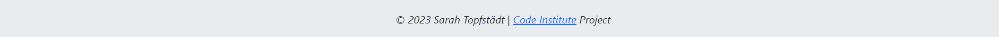

## CONTENTS

* [Introduction](#introduction-digital-patient)
* [User Experience - UX](#user-experience)
  * [UX](#ux)
    * [Site purpose](#site-purpose)
    * [Site goal](#site-goal)
    * [Audience](#audience)
  * [User stories](#user-stories)
    * [First time user goals](#first-time-user-goals)
    * [Returning user goals](#returning-user-goals)
  * [Agile methodology](#agile-methodology)
  * [Design](#design)
    * [Colours](#colours)
    * [Typography](#typography)
    * [Media](#media)
    * [Database schema](#database-schema)
    * [Wireframes](#wireframes)
* [Features](#features)
  * [Existing features](#existing-features)
  * [Future features](#future-features)
* [Technologies used](#technologies-used)
  * [Languages](#languages)
  * [Frameworks libraries, programs](#frameworks-libraries-programs)
* [Testing](TESTING.md)
* [Deployment](#deployment)
  * [Forking](#forking)
  * [Cloning the repo with GitPod or Codeanywhere](#cloning-the-repo-with-gitpod-or-codeanywhere)
  * [Running the project locally](#running-the-project-locally)
  * [Deploying with Heroku](#deploying-with-heroku)
* [Credits](#credits)

# Introduction: Digital patient

Project Portfolio 4 for Code Institute Full-stack development program. Digital patient is a full stack Django project that runs on Heroku.

The site allows users to register and log in from the frontend. Once registered and logged in users can edit personal data, edit, add and delete diseases/medications, doctors and contacts.

The live website on Heroku can be accessed at the following link: [View my Live Website here](https://digital-patient-807175a8312b.herokuapp.com/)

# User Experience
<a href="#top">Back to the top.</a>

## UX

### Site purpose

This program is designed to make it easier for a patient to keep track of their doctors, diseases, medications, as well as (emergency) contacts. In addition, in the case of an emergency, it should be possible for doctors to see a readable version of the patient's profile to see previous diseases, medications, previous doctors and emergency contacts.

### Site goal

To build a website where a kind of digital patient dossier can be easily shared by the patient him/herself for possible emergencies.

A tool like this does not (yet) exist in Germany, and in the case of an emergency with, for example, an unconscious patient, the doctors may not know any previous diseases, medications, general practitioners or emergency contacts, or they may first have to laboriously collect these on individual platforms or (mobile) devices.

### Audience

For anyone who wants to have all their emergency data on one platform for potential doctors in case of an emergency.

## User stories

### First time user goals

- As a first time user I can find information what the purpose of the website is.

### Returning user goals

- As a (returning) user I can register for an account so that I can login after registration.
- As a returning user I can log in to my registered account.
- As a returning user I can log out of my registered account.
- As a returning user I can edit my personal data.
- As a returning user I can edit, add and delete medication/diseases, doctors and contacts in my registered account.
- As a returning user I can share a readable version of my account with potential doctors in case of an emergency.

## Agile methodology

The principles of agile methodology were utilized during the project. Github issues were used to create User Stories for the project. Each user story (including user acceptance criteria, tasks and story points) can be displayed on the board or in the issues. By assigning user stories to issues and taking advantage of the GitHub Kanban board functionality, the necessary goals and priorities throughout the project could be well defined. In addition, labels were used to further define the priority of each user story in the Kanban board.

Through the use of the Kanban board in the projects view in Github, the project was divived into a few different sections:

- Add-ons
- To-do
- In progress
- Done

Milestones were used to create sprints. There were 3 sprints each dated appropriately. User Stories were completed based on the current sprint in progress. Each sprint was completed on time.

## Design

### Colors

I decided to use calming colors, primarily shades of blue. Blue is the typical business color, as it is sober, businesslike, calming and trustworthy, and it maintains its character even in different gradations. It best connects to the goal of the website. To keep the contrast between the background and the font, a basis black tone and a lightly grey is included. All colors also connect to Bootstrap's existing colors (primary, secondary and dark).

### Typography

Utilized the Bootstrap 5 native font stack that selects the best font-family for each OS and device. Besides this, the font gives a calm and serious impression.

### Media
The pictures (background image, favicons) were taken from [Pixabay](https://pixabay.com/).

### Database scheme
The database model reflects the different areas of the website: the personal data through the model "UserProfile", the entries for medications/diseases through the model "MediDisLis", the entries for doctors through the model "Doctor" and the entries for contacts through the model "Contact".

### Wireframes
Initial wireframes

#### Home page

#### Register

#### Login

#### Overview (profile)

#### Personal data

#### Edit personal data

#### Medications/Diseases

#### Doctors

#### Contacts

# Features
<a href="#top">Back to the top.</a>

## Existing features

- __Home screen__
  - The home screen shows information about the website and explains briefly in a FAQ the most important things.
  - The image is intended to symbolize the interface between doctor and patient via the digital medium/the website.

  

- __Navigation Bar__
  - The navigation bar appears on each page.
  - The home screen can be displayed by clicking on the logo on the left side.
  - The navigation bar for unauthenticated users contains links to the home screen, register and login.

  

  - The navigation bar for authenticated users contains links for logout and a drop down menu with links to the five important pages of the website: Overview (profile), personal data, medication/diseases, doctors, contacts.

  
  

  - The navigation bar will allow the users to easily navigate from page to page across all devices.
  - The navigation bar is fully responsive. On smaller devices, the hamburger menu appears with an expanded menu bar.

  

  

- __Footer__
  - The footer appears on each page.
  - The footer is sticky.
  - The footer contains a copyright and a link to Code Institute which opens in a new tab.

  

- __Register__
  - The page is intended for new users to register. 
  - The users have to enter an e-mail address, a username and the password twice.

  
  
  - After successful registration, users should receive a confirmation email.

  

  - When users click on the link in the mail, they are redirected to the email confirmation page.
  - After clicking the "Confirm" button, they will be redirected to overview.

  

  - If the link is invalid or expired, an error message appears.

  

- __Login__
  - The page is intended for registered users to log in. 
  - The users have to enter their e-mail address or username and the password.
  - When logging in, the 'Remember me' function can also be activated.

  

- __Logout__
  - The page is intended for registered users to log out. 
  - The user is asked if he/she really wants to log out before the final logout. 
  - Only after confirming by clicking on the button, the user is logged out and redirected to the home screen.

  

- __Lost password__
  - The page is intended for registered users to get a new password if they forgot it. 
  - Users can get a new password by clicking on the 'Forgot password' button. They will then be redirected and will need to enter their registered email address.

  
  

  - Users will then receive a reset link to their registered email address.
  - In this email, users will also be reminded of their username.

  

  - After clicking the link in the email, users can set a new password, which they have to type twice.

  
  
