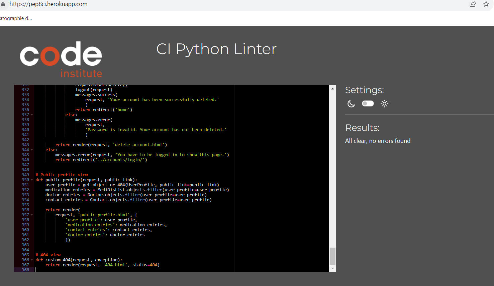
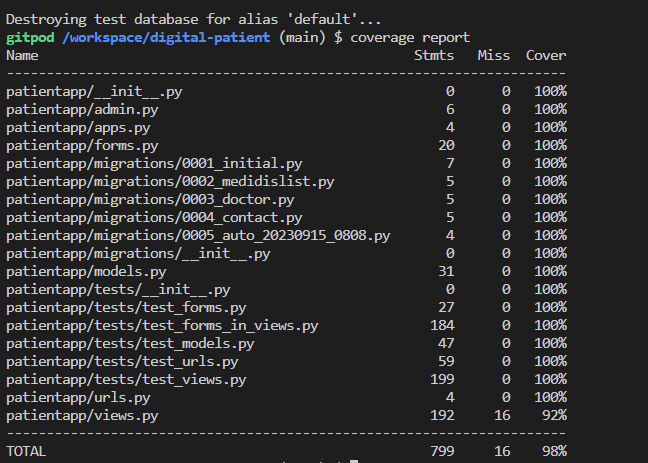
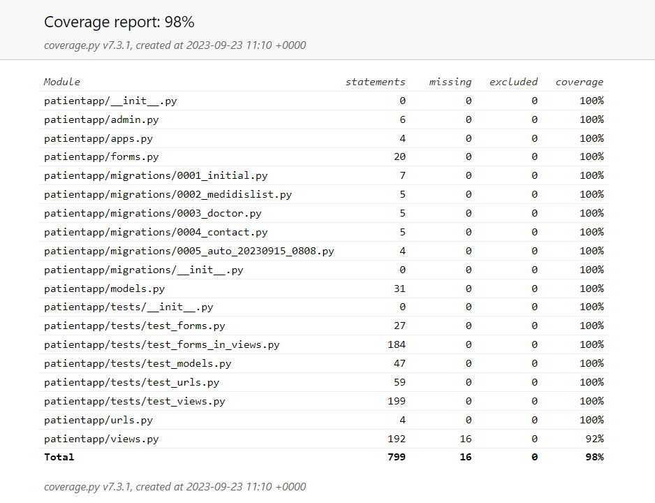

# Testing
  * [Validator testing](#validator-testing)
  * [Automated testing](#automated-testing)
    * [Automated testing for forms in views.py](#automated-testing-for-forms-in-viewspy)
    * [Automated testing for forms.py](#automated-testing-for-formspy)
    * [Automated testing for models.py](#automated-testing-for-modelspy)
    * [Automated testing for urls.py](#automated-testing-for-urlspy)
    * [Automated testing for views.py](#automated-testing-for-viewspy)
    * [Not automated tested](#not-automated-tested)
  * [User story/Manual testing](#user-storymanual-testing)
  * [Bugs](#bugs)
    * [Fixed bugs](#fixed-bugs)
    * [Remaining bugs](#remaining-bugs)

Testing has taken place continuously throughout the development of the project. The app was tested regularly and deployed early to Heroku to confirm local and remote functioned the same.

## Validator testing

- __HTML__
  - No errors were returned when passing through the official [W3C validator](https://validator.w3.org/nu/?doc=https%3A%2F%2Fdigital-patient-807175a8312b.herokuapp.com%2F).

- __CSS__
  - No errors were found when copy the styles.css in the official Jigsaw validator but when running the link, some issues showed up from the external library Bootstrap [Results](https://jigsaw.w3.org/css-validator/validator?uri=https%3A%2F%2Fdigital-patient-807175a8312b.herokuapp.com%2F&profile=css3svg&usermedium=all&warning=1&vextwarning=&lang=de).

- __JS__
  - No errors were found when passing through the official [JS validator](https://jshint.com/).

- __Python__
  - The python-code was run through the Code Institute Python Linter and showed no errors.

  

Google Lighthouse was used to test performance, best practices, accessibility and SEO on desktop and mobile devices.

The testing was done using the Google Chrome browser. Chrome developer tools were used extensively, particularly to check responsiveness on different screen sizes. Testing was also done using Edge and Firefox on desktop, and again on an iPad Mini and iPhone using Safari.

- Responsive on all device sizes between 280px - 2600px wide
- Devices tested using the Google Developer Tools emulator:
  - iPhone SE (375x667px)
  - iPhone XR (414x896px)
  - iPhone 12 Pro (390x844px)
  - Pixel 5 (393x851px)
  - Samsung Galaxy S8+ (360x740px)
  - Samsung Galaxy S20 Ultra (412x915px)
  - iPad Air (820x1180px)
  - iPad Mini (768x1024px)
  - Surface Pro 7 (912x1368px)
  - Surface Duo (540x720px)
  - Galaxy Fold (280x653px)
  - Samsung Galaxy A15/71 (412x912px)
  - Nest Hub (1024x600px)
  - Nest Hub Max (1280x800px)

- Desktop Results: [should be added]
- Mobile Results: [should be added]

## Automated testing
<a href="#top">Back to the top.</a>

All test files are located in the patientapp/tests folder in the project. Automated tests were run for almost all views, forms in views, forms, urls and models. The tests were executed with the command "python3 manage.py test" or for individual test files with the specific command "python3 manage.py test patientapp.tests.test_views". In addition, the coverage tool was installed with the command "pip3 install coverage". With "coverage run --source=patientapp manage.py test" the tool was executed and with "coverage report" the report results were created. For the automated tests, the sqlite3 database present in the settings.py was used.

With "coverage html" a html report was created.

### Automated testing for forms in views.py

| Test Case                                 | Description                                                       | Result |
|------------------------------------------|-------------------------------------------------------------------|--------|
| `PersonalDataFormTest`                   | Test saving the Personal Data Form with a user.                 | Pass   |
| `test_personal_data_form_save_with_user` | Ensures that the Personal Data Form saves correctly with a user. | Pass   |
| `MedidisViewTest`                        | Test Medication List entry creation functionality.               | Pass   |
| `test_medication_entry_creation`         | Checks if adding a Medication List entry via 'medidis' view works.| Pass   |
| `test_invalid_medication_entry`          | Tests invalid Medication List entry rejection.                  | Pass   |
| `EditMedidisViewTest`                    | Test editing Medication List entry functionality for an authenticated user. | Pass   |
| `test_edit_medidis_authenticated_user`   | Ensures that an authenticated user can edit a Medication List entry via 'edit_medidis' view and the changes are saved successfully. | Pass   |
| `DeleteMedidisViewTest`                  | Test deleting a Medication List entry functionality for an authenticated user. | Pass   |
| `test_delete_medidis_view`               | Checks if an authenticated user can delete a Medication List entry via 'delete_medidis' view and it gets deleted successfully. | Pass   |
| `DoctorViewTest`                         | Test Doctor entry creation functionality.                        | Pass   |
| `test_doctor_entry_creation`             | Checks if adding a Doctor entry via 'doctor' view works.         | Pass   |
| `test_invalid_doctor_entry`              | Tests invalid Doctor entry rejection.                            | Pass   |
| `EditDoctorViewTest`                     | Test editing Doctor entry functionality for an authenticated user. | Pass   |
| `test_edit_doctor_authenticated_user`    | Ensures that an authenticated user can edit a Doctor entry via 'edit_doctor' view and the changes are saved successfully. | Pass   |
| `DeleteDoctorViewTest`                   | Test deleting a Doctor entry functionality for an authenticated user. | Pass   |
| `test_delete_doctor_view`                | Checks if an authenticated user can delete a Doctor entry via 'delete_doctor' view and it gets deleted successfully. | Pass   |
| `ContactViewTest`                        | Test Contact entry creation functionality.                       | Pass   |
| `test_contact_entry_creation`            | Checks if adding a Contact entry via 'contact' view works.       | Pass   |
| `test_invalid_contact_entry`             | Tests invalid Contact entry rejection.                           | Pass   |
| `EditContactViewTest`                    | Test editing Contact entry functionality for an authenticated user. | Pass   |
| `test_edit_contact_authenticated_user`   | Ensures that an authenticated user can edit a Contact entry via 'edit_contact' view and the changes are saved successfully. | Pass   |
| `DeleteContactViewTest`                  | Test deleting a Contact entry functionality for an authenticated user. | Pass   |
| `test_delete_contact_view`               | Checks if an authenticated user can delete a Contact entry via 'delete_contact' view and it gets deleted successfully. | Pass   |

### Automated testing for forms.py

| Test Case                          | Description                                                             | Result |
|-----------------------------------|-------------------------------------------------------------------------|--------|
| `PersonalDataFormTests`           | Test the Personal Data Form for validity with valid input data.         | Pass   |
| `test_personal_data_form_valid`   | Ensure that the Personal Data Form is valid when provided with valid data. | Pass   |
| `test_personal_data_form_invalid` | Ensure that the Personal Data Form is invalid when provided with invalid data. | Pass   |
| `MedicationListFormTests`         | Test the Medication/Diseases Form for validity with valid input data.   | Pass   |
| `test_medication_list_form_valid` | Ensure that the Medication/Diseases Form is valid when provided with valid data. | Pass   |
| `DoctorFormTests`                 | Test the Doctor Form for validity with valid input data.                | Pass   |
| `test_doctor_form_valid`          | Ensure that the Doctor Form is valid when provided with valid data.    | Pass   |
| `ContactFormTests`                | Test the Contact Form for validity with valid input data.              | Pass   |
| `test_contact_form_valid`         | Ensure that the Contact Form is valid when provided with valid data.   | Pass   |

### Automated testing for models.py

| Test Case             | Description                                                       | Result |
|-----------------------|-------------------------------------------------------------------|--------|
| `TestUserProfile`     | Test the UserProfile model for various aspects.                   | Pass   |
| `test_user_profile_str` | Ensure that the `str` method of UserProfile returns the expected username. | Pass   |
| `test_user_profile_defaults` | Check if UserProfile fields `want_resuscitate` and `share` have default values. | Pass   |
| `test_user_profile_has_user` | Verify if the UserProfile has an associated User.                | Pass   |
| `test_user_profile_has_birthday` | Verify if the UserProfile has the expected birthday date.       | Pass   |
| `TestMediDisList`     | Test the MediDisList model for various aspects.                   | Pass   |
| `test_medi_dis_list_str` | Ensure that the `str` method of MediDisList returns the expected username. | Pass   |
| `test_medi_dis_list_defaults` | Check if the MediDisList field `instructions` has a default value. | Pass   |
| `TestDoctor`          | Test the Doctor model for various aspects.                        | Pass   |
| `test_doctor_str`     | Ensure that the `str` method of Doctor returns the expected username. | Pass   |
| `test_doctor_defaults` | Check if the Doctor field `details` has a default value.          | Pass   |
| `TestContact`         | Test the Contact model for various aspects.                       | Pass   |
| `test_contact_str`    | Ensure that the `str` method of Contact returns the expected username. | Pass   |
| `test_contact_defaults` | Check if the Contact field `details` has a default value.        | Pass   |

### Automated testing for urls.py

| Test Case                        | Description                                                      | Result |
|----------------------------------|------------------------------------------------------------------|--------|
| `TestHomeURL`                    | Test whether the 'home' URL resolves to the 'home' view.         | Pass   |
| `test_home_url_resolves`         | Verify that the 'home' URL resolves to the 'home' view function. | Pass   |
| `TestProfileURL`                 | Test whether the 'profile' URL resolves to the 'profile' view.   | Pass   |
| `test_profile_url_resolves`      | Verify that the 'profile' URL resolves to the 'profile' view function. | Pass   |
| `TestViewPersonalDataURL`        | Test whether the 'personal_data' URL resolves to the 'view_personal_data' view. | Pass   |
| `test_view_personal_data_url_resolves` | Verify that the 'personal_data' URL resolves to the 'view_personal_data' view function. | Pass   |
| `TestEditPersonalDataURL`        | Test whether the 'edit_personal_data' URL resolves to the 'edit_personal_data' view. | Pass   |
| `test_edit_personal_data_url_resolves` | Verify that the 'edit_personal_data' URL resolves to the 'edit_personal_data' view function. | Pass   |
| `TestMediDisURL`                 | Test whether the 'medidis' URL resolves to the 'medidis' view.   | Pass   |
| `test_medidis_url_resolves`      | Verify that the 'medidis' URL resolves to the 'medidis' view function. | Pass   |
| `TestEditMediDisURL`             | Test whether the 'edit_medidis' URL resolves to the 'edit_medidis' view. | Pass   |
| `test_edit_medidis_url_resolves`  | Verify that the 'edit_medidis' URL resolves to the 'edit_medidis' view function. | Pass   |
| `TestDeleteMediDisURL`           | Test whether the 'delete_medidis' URL resolves to the 'delete_medidis' view. | Pass   |
| `test_delete_medidis_url_resolves` | Verify that the 'delete_medidis' URL resolves to the 'delete_medidis' view function. | Pass   |
| `TestDoctorURL`                  | Test whether the 'doctor' URL resolves to the 'doctor' view.     | Pass   |
| `test_doctor_url_resolves`       | Verify that the 'doctor' URL resolves to the 'doctor' view function. | Pass   |
| `TestEditDoctorURL`              | Test whether the 'edit_doctor' URL resolves to the 'edit_doctor' view. | Pass   |
| `test_edit_doctor_url_resolves`  | Verify that the 'edit_doctor' URL resolves to the 'edit_doctor' view function. | Pass   |
| `TestDeleteDoctorURL`            | Test whether the 'delete_doctor' URL resolves to the 'delete_doctor' view. | Pass   |
| `test_delete_doctor_url_resolves` | Verify that the 'delete_doctor' URL resolves to the 'delete_doctor' view function. | Pass   |
| `TestContactURL`                 | Test whether the 'contact' URL resolves to the 'contact' view.   | Pass   |
| `test_contact_url_resolves`      | Verify that the 'contact' URL resolves to the 'contact' view function. | Pass   |
| `TestEditContactURL`             | Test whether the 'edit_contact' URL resolves to the 'edit_contact' view. | Pass   |
| `test_edit_contact_url_resolves`  | Verify that the 'edit_contact' URL resolves to the 'edit_contact' view function. | Pass   |
| `TestDeleteContactURL`           | Test whether the 'delete_contact' URL resolves to the 'delete_contact' view. | Pass   |
| `test_delete_contact_url_resolves` | Verify that the 'delete_contact' URL resolves to the 'delete_contact' view function. | Pass   |
| `TestDeleteAccountURL`           | Test whether the 'delete_account' URL resolves to the 'delete_account' view. | Pass   |
| `test_delete_account_url_resolves` | Verify that the 'delete_account' URL resolves to the 'delete_account' view function. | Pass   |

### Automated testing for views.py

| Test Case                              | Description                                                          | Result   |
|----------------------------------------|----------------------------------------------------------------------|----------|
| `HomeViewTestCase`                    | Test the home view for rendering 'index.html' with a 200 status code. A successful response should be returned with a status code of 200 indicating that the homepage is accessible. | Pass   |
| `ProfileViewTestCase`                 | Test profile view for both authenticated and unauthenticated users. An authenticated user should be able to access their profile page, while an unauthenticated user should be redirected to the login page with a status code of 302. | Pass   |
| `ViewPersonalDataTestCase`            | Test view personal data view for both authenticated and unauthenticated users. An authenticated user should be able to access their personal data, while an unauthenticated user should be redirected to the login page with a status code of 302. | Pass   |
| `EditPersonalDataViewTestCase`        | Test edit personal data view for both authenticated and unauthenticated users. An authenticated user should be able to edit their personal data, while an unauthenticated user should be redirected to the login page with a status code of 302. | Pass   |
| `MedidisViewTestCase`                 | Test medidis view for both authenticated and unauthenticated users. An authenticated user should be able to access the medication list, while an unauthenticated user should be redirected to the login page with a status code of 302. | Pass   |
| `EditMedidisViewTestCase`             | Test edit medidis view for both authenticated and unauthenticated users. An authenticated user should be able to edit a medication list entry, while an unauthenticated user should be redirected to the login page with a status code of 302. | Pass   |
| `DeleteMedidisViewTestCase`           | Test delete medidis view for both authenticated and unauthenticated users. An authenticated user should be able to delete a medication list entry, while an unauthenticated user should be redirected to the login page with a status code of 302. | Pass   |
| `DoctorViewTestCase`                  | Test doctor view for both authenticated and unauthenticated users. An authenticated user should be able to access the doctor list, while an unauthenticated user should be redirected to the login page with a status code of 302. | Pass   |
| `EditDoctorViewTestCase`              | Test edit doctor view for both authenticated and unauthenticated users. An authenticated user should be able to edit a doctor entry, while an unauthenticated user should be redirected to the login page with a status code of 302. | Pass   |
| `DeleteDoctorViewTestCase`            | Test delete doctor view for both authenticated and unauthenticated users. An authenticated user should be able to delete a doctor entry, while an unauthenticated user should be redirected to the login page with a status code of 302. | Pass   |
| `ContactViewTestCase`                 | Test contact view for both authenticated and unauthenticated users. An authenticated user should be able to access the contact list, while an unauthenticated user should be redirected to the login page with a status code of 302. | Pass   |
| `EditContactViewTestCase`             | Test edit contact view for both authenticated and unauthenticated users. An authenticated user should be able to edit a contact entry, while an unauthenticated user should be redirected to the login page with a status code of 302. | Pass   |
| `DeleteContactViewTestCase`           | Test delete contact view for both authenticated and unauthenticated users. An authenticated user should be able to delete a contact entry, while an unauthenticated user should be redirected to the login page with a status code of 302. | Pass   |
| `DeleteAccountViewTestCase`           | Test delete account view for authenticated users with the correct password, authenticated users with an incorrect password, and unauthenticated users. An authenticated user providing the correct password should result in a successful account deletion with a status code of 302. An authenticated user providing an incorrect password should receive an error message with a status code of 200. An unauthenticated user should be redirected to the login page with a status code of 302. | Pass   |
| `Custom404TestCase`                   | Test the custom 404 view for handling 404 errors. This test ensures that a non-existent page returns a 404 status code and uses the custom 404 template. | Pass   |

### Not automated tested

| Function/View                   | Description                                                                      |
|---------------------------------|----------------------------------------------------------------------------------|
| `form = PersonalDataForm(request.POST, instance=user_profile)` | Creates a form with POST data in a view; tested manually.       |
| edit_personal_data - form in views.py: `if form.is_valid():`           | Checks if the form is valid in a view, including condition checks and assignments as well as redirections; tested manually.                  |
| `public_profile` View          | Renders a public profile page with data from the database; tested manually.      |
| `custom_404` View              | Handles 404 error cases by rendering a '404.html' page; tested manually. |
